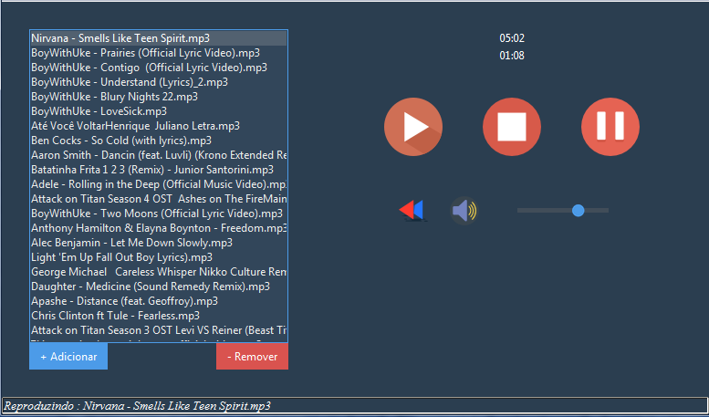

# GDPlayer
Um reprodudor de música simples feito com Python e Tkinter

Este é um aplicativo que permite reproduzir as sua músicas mp3 utilizando o Python e com uma interface super amigável para ter uma boa experiência do usuário.

## Tela Principal

